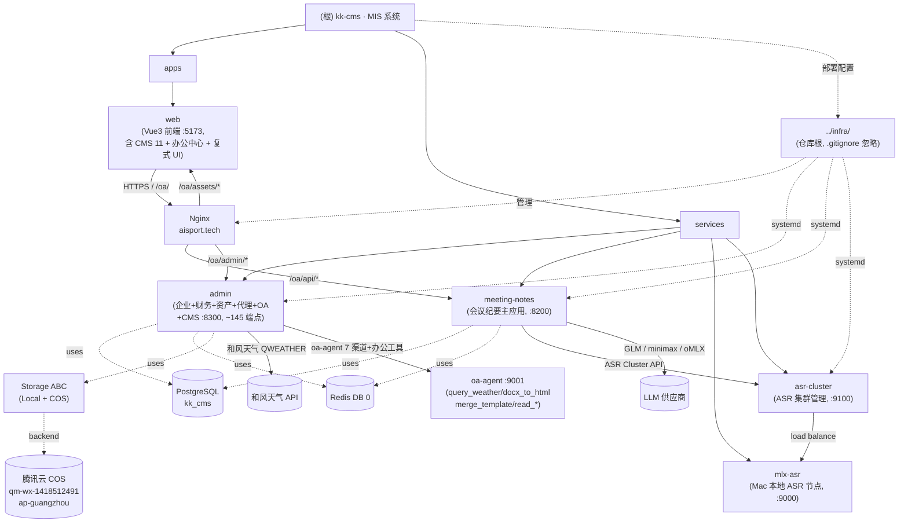

[根目录](../CLAUDE.md) > **mis-system**

# kk-CMS · 企业 MIS 管理系统

## 变更记录 (Changelog)

- 2026-07-15 11:42:03 — 续跑增量更新（zcf:init-project）：
  - **Sprint 0/1/2 收官（Storage + COS + Univer）**（详见 memory `project-sprint0-storage-2026-07-14.md` + `project-sprint2-univer-spike-2026-07-14.md`）：
    - admin 加 `app/services/storage/`（`Storage` ABC + `LocalStorage` 默认 + `CosStorage` 腾讯云 ap-guangzhou / Bucket `qm-wx-1418512491` + `STSCredentialProvider`）；admin 加 `routes/storage.py`（前端直传 presign + health），`/api/v1/storage/{presign,health}` 2 端点；
    - admin 14 个写文件点统一到 Storage 抽象（CMS media upload + 富文本资源 + agent 资源等）；前端 `cms.ts` uploadMedia 直传优先 + 中转 fallback；CORS 配齐（`aisport.tech` + `localhost:5173`）；Phase 2 已 commit `f8443f3`；
    - Sprint 2 Univer 官方 Vue3 preset 集成（`@univerjs/preset-sheets-core` + UMD+locale 打包 5.7MB），SheetSpike 验证 OK；OfficeCenter 已接入 xlsx → SheetJS 解析 → cellData → Univer 渲染；
    - 密钥：qmwx-cos-uploader 子账号已建第 2 密钥 AKIDI5i...（03:57）给 kk-mis 用（6 passed 验证），旧密钥 AKIDDHBu...q4M 留着不禁用（别处在用）；
  - **财务复式记账 + A4 打印 + 工作台拖拽 + dy8 部署**（详见 memory `project-mis-finance-print-2026-07-15.md`）：
    - admin 加 `routes/finance/vouchers.py`（Voucher+JournalEntry 借贷平衡 Σdebit=Σcredit 校验，POST 过账更新账户余额 `balance += debit - credit`）+ `models/finance.py` 加 `Voucher`/`JournalEntry` 表 + `FinanceAccount` 复式改造（5 类 `asset/liability/equity/revenue/expense` + `balance_direction` 借/贷 + 12 标准科目 seed）；
    - 前端加 `views/finance/VoucherList.vue` 复式 UI（借贷平衡实时校验）+ `components/VoucherPrint.vue` A4 打印（`@media print` + 新窗口 + `computed` 非 `ref`）+ `views/Dashboard.vue` 工作台拖拽（vuedraggable + `User.preferences` JSON）；
    - 生产 dy8 用户（super_admin，2026-07-15 部署，导航 工作台→财务→办公→代理）；
    - **3 报表已实装**（试算/资负/利润）；教训：超管判断硬编码 username 是顽疾（rbac 审计犯过又犯）—— **必须用 role code**；
  - **oa-agent 办公桥已 commit（详见下方 2026-07-15 早期条目）**：office.py + office/bridge.py + OfficeCenter.vue 端到端真通；
  - **测试基线更新**：191→**~245 passed 0 pre-existing**（admin 104 + meeting-notes 19 + asr-cluster 16 + mlx-asr 13 + web vitest 46 + Playwright 3 + storage 集成 6 桩 + office 16 含 skip）；admin 25+ 测试文件（94 + test_voucher 9 + test_office 16 + test_storage_* 4 + integration 1）；vue-tsc 0；前端 vitest 46 全过；
  - **接口清单更新**：~124 → **~145 端点**（+ CMS 12 router + office 5 + storage 2 + voucher 3）；
  - **前端新增**：`views/finance/VoucherList.vue` + `views/office/OfficeCenter.vue` + `views/office/SheetSpike.vue` + `views/agent/AgentDashboard.vue` + `views/agent/WithdrawalView.vue` + `views/PromoPage.vue` + `views/cms/ProductView.vue`（公开页）+ `components/VoucherPrint.vue` + `components/UniverSheet.vue`；
  - **后端新增路由文件**：`routes/finance/vouchers.py`（3 端点）+ `routes/office.py`（5 端点）+ `routes/storage.py`（2 端点）+ `routes/agent/promo.py` + `routes/agent/withdrawal.py` + `routes/member.py`（VIP 卡会员侧）；
  - **后端新增 service**：`services/office/__init__.py` + `services/office/bridge.py`（httpx → oa-agent /tools）+ `services/storage/{protocol,local,cos,sts,errors,metrics}.py` + `services/dynamic_code.py` + `services/points.py` + `services/approval_engine.py`；
  - **后端新增 model**：`models/cms.py`（10 表）+ `models/member.py`（VIP 会员）+ `models/social.py`（社交/推广）+ `models/audit.py`（审计增强）；
  - **新增 cms router（11 个）**：auth / products / media / merchants / leads / orders / coupons / reviews / stats / payments / weather（search 在 products.py 内合并）；
  - **修正 2026-07-15 早期条目**：CMS router 实际为 11 个（auth/products/media/merchants/leads/orders/coupons/reviews/stats/payments/weather），原"12 router"含 search 实为 products 内的搜索端点；
  - **更新"下一步建议"**：原建议全完成；新增"voucher 旧 transactions 字段迁移脚本"/"Office 真实场景接入"/"vite proxy .js 删掉统一 .ts"。
- 2026-07-15 — office 桥全链路打通 + dev proxy 修复（详见 memory `project-officecli-bridge-2026-07-14.md`）：
  - **oa-agent 加 `/tools` 直接工具端点**：`GET /tools` + `POST /tools/{name}`（复用 `registry.adispatch` 绕过 LLM）+ 新增 `docx_to_html`(mammoth)/`merge_template`(docxtpl) 工具，16 测试过；
  - **admin office 桥**：`app/services/office/`(httpx) + `app/routes/office.py`（`/api/v1/office/{health,tools,read,preview,merge}` → oa-agent），16 测试过；
  - **前端 OfficeCenter**：`views/office/OfficeCenter.vue`（el-tabs：读取 + docx 预览 DOMPurify + 模板合并）+ 路由 `/office`；vue-tsc 0；Playwright E2E 全通（health 9 工具 + docx 预览段落渲染）；
  - **dev proxy 修复（项目级）**：发现 `vite.config.js` 优先于 `.ts`（改 .ts 无效）+ `base:'/oa/'` 使 proxy `/admin` 不匹配前端 `/oa/admin` → 加 `devStripOaPrefix` plugin 中间件（前置于 proxy）去 /oa 前缀；**修了整个前端 dev 调后端 404**（不只 office），prod 走 nginx 不受影响；
  - **officecli 证伪**：记忆里的 "officecli" 是设想名词（本地零存在），真能力中心是 oa-agent。
- 2026-07-14 14:54:32 — 续跑增量更新（zcf:init-project）：
  - **CMS 内容管理模块全完成**（VIP 卡旅游产品 + A 订制游 + C 权益卡，详见 memory `project-cms-module-2026-07-14.md`）：admin 嵌入 12 router（auth/products/media/merchants/leads/orders/coupons/reviews/stats/payments/weather/search）+ 3 service（payment 支付网关 / weather 和风实时 / notifier webhook）+ 10 数据模型表（`models/cms.py`）；前端 views/cms 11 视图 + RichEditor + MediaPicker + EndUser store；真发卡 + C 端账号 + 公开页 `/product/:slug` + 移动端 H5 + 漏斗分析；admin 131p / vue-tsc 0 / vitest 46 全 push，**已部署到 `43.129.201.118`**；
  - **测试基线重置**（详见 memory `project-fullstack-audit-2026-07-14.md`）：476/447 passed + 5 pre-existing → **191 passed 0 pre-existing**（admin 94p + meeting-notes 19 + asr-cluster 16 + mlx-asr 13 + web vitest 46 + Playwright 3）；pre-existing 根因为 admin `.venv` 缺 `pydantic_settings` 依赖；2 真实 BUG 修复（globalSetup teardown 路径错位 + locustfile quote 404 容忍）；
  - **前端 `any` 159→87**（`getApiError` DRY + `as const` + 9 个新 interface；剩 87 个 `ref<any[]>` 为 EP el-table row 框架限制）；
  - **后端异味清理**（Pydantic `Config`→`ConfigDict` 5 schema 25 处 / SQLAlchemy `declarative_base` 迁移 / FastAPI `on_event`→`lifespan` asr-cluster / `__import__("fastapi").Depends()`→正常 import admin 6 处 / meeting-notes jwt secret 11→36 字节）；
  - **下一步建议更新**：移除已完成的"mlx-asr 测试补齐"，新增 CMS 真支付 + 前端 EP row 精确化（低优）+ oa-agent push。
- 2026-07-13 10:58:44 — 续跑增量更新（zcf:init-project）：
  - **面包屑路径修正**：原 `[根目录](../../CLAUDE.md)` 从本文件出发实际指向 `services/` 而非仓库根，已改为 `[根目录](../CLAUDE.md)`（本文件位于 `mis-system/`，`../` 即仓库根）；
  - **Mermaid 拓扑补 infra 外部引用节点**（`../infra/`，仓库根部署配置，被 .gitignore 忽略）；
  - **修正 infra 描述**：原"infra/ 位于仓库外"不准确，实际位于仓库根（`../infra/` 相对本目录），被根 .gitignore 忽略；
  - **修正测试段**：admin 测试从"24/24"更新为"12+ 文件含 integration/e2e/performance"；前端从"暂未配 Vitest"更新为"vitest 2.1.9 + 30 passed"；补 meeting-notes（3 文件）与 asr-cluster（2 文件）测试状态；
  - **修正"下一步建议"**：原"前端测试补齐"与"asr-cluster 容器化"均已完成，替换为新建议。
- 2026-07-12 16:08:16 — 仓库根 CLAUDE.md 续跑：本目录已被仓库根文档 `../CLAUDE.md` 索引定位，本文件聚焦代码项目本身。
- 2026-07-12 15:55:11 — 初始化 AI 上下文（zcf:init-project），生成根级与 5 个模块级 CLAUDE.md。

---

## 项目愿景 (Vision)

kk-cms 是一套面向中小型企业的 **一体化管理 SaaS 系统**，通过单一平台统一管理会议纪要、企业组织、财务收支（含复式记账）、卡券资产、代理分销、OA 办公、**CMS 内容（VIP 卡旅游产品）**、**oa-agent 办公协同（文档读写 + 模板合并 + Univer Sheets）**，消除系统割裂与数据孤岛，降低管理成本。

核心价值主张：
- **AI 驱动**：会议录音一键转写 + LLM 智能整理，沉淀决策与行动项；oa-agent 7 渠道联网 + 天气数据 + AI 设计行程 + 文档处理
- **一体化**：8 大模块（含 CMS + 办公桥）共享 RBAC、JWT、审计日志、统一导航
- **开箱即用**：Teal 湖青主题前端 + FastAPI 后端 + PostgreSQL，生产可部署；CMS 公开页 + 移动端 H5 即可触达 C 端用户
- **可扩展存储**：Storage 抽象层 + 腾讯云 COS，前端直传 + 14 个写点统一管理

---

## 架构总览 (Architecture)

### 模块结构图 (Mermaid)



### 数据流 (Data Flow)

1. **浏览器** → `https://aisport.tech/oa/` → **Nginx**（内联配置，反代 `/oa/api/*`、`/oa/admin/*`、`/oa/assets/*`）
2. **Nginx** → **FastAPI 服务**（meeting-notes :8200 / admin :8300）
3. **meeting-notes** → **asr-cluster (:9100)** 自动负载均衡到 **mlx-asr (:9000)** Mac 本地节点（Tailscale 100.88.88.x 内网）
4. **meeting-notes** → **LLM**（智谱 GLM-4.7 / minimax / 本地 oMLX）
5. **admin** → **和风天气 API**（`QWEATHER_KEY`）+ **oa-agent :9001**（query_weather + AI 设计行程 + 办公工具）
6. **admin + meeting-notes** → **PostgreSQL**（`kk_admin` / `kk_cms` 库，postgres 用户）+ **Redis**
7. **CMS 公开页** → `https://aisport.tech/oa/product/:slug`（无需登录，SEO + 行程/权益/评价/相关推荐 + 目的地天气）
8. **CMS 媒体直传** → 前端 PUT 到 COS（presigned URL，省后端带宽）
9. **办公文档处理** → admin `/api/v1/office/*` → oa-agent `/tools/{name}`（docx 预览/模板合并/读取，绕过 LLM）

### 部署拓扑（生产）

- 域名：`aisport.tech`（SSL 由 Caddy 提供，Nginx 监听 80/443 反代 `/oa/*`）
- 进程管理：systemd（`kk-mis-meeting-notes.service` / `kk-mis-admin.service` / `kk-mis-asr-cluster.service`，配置位于仓库根 `../infra/systemd/`）
- Nginx 配置：`../infra/nginx/kk-cms.conf`（会议纪要 + ASR 集群）+ `kk-cms-admin.conf`（admin + CMS + 办公桥）
- 运维脚本：`../infra/scripts/`（backup_pg / health_check / reconcile，crontab 调度）
- 网络：Tailscale VPN 跨 Mac（开发机）与 Linux 服务器（`43.129.201.118`，Debian，root ssh key）
- 部署方式：仓库根 `../infra/` 目录通过 `scp` 直传（GitHub 网络不稳，详见 project-mis-deploy.md）

---

## 模块索引 (Module Index)

| 模块 | 路径 | 端口 | 技术栈 | 一句话职责 |
|------|------|------|--------|------------|
| **web** | `apps/web/` | 5173 (dev) / 静态产物 | Vue 3.5 + TS + Element Plus + Vite | 8 大模块统一前端，Teal 湖青主题（含 CMS 11 视图 + 办公中心 + Voucher 复式 UI） |
| **admin** | `services/admin/` | 8300 | FastAPI + SQLAlchemy 2.0 async | 企业 RBAC + 财务（复式记账）+ 资产 + 代理 + OA + **CMS（VIP 旅游）** + **oa-agent 办公桥** + **Storage 抽象层**（~145 端点） |
| **meeting-notes** | `services/meeting-notes/` | 8200 | FastAPI + SQLAlchemy async | 会议音频上传 → ASR → LLM 整理 |
| **mlx-asr** | `services/mlx-asr/` | 9000 | FastAPI + mlx-whisper | Mac 本地语音转写（Apple Silicon 优化） |
| **asr-cluster** | `services/asr-cluster/` | 9100 | FastAPI + httpx | 多 MLX 节点 ASR 集群注册与负载均衡 |

> ⚠️ `../infra/` 部署配置目录位于**仓库根**（相对本目录为 `../infra/`），含 systemd×3 + nginx×2 + scripts×3，被根 `.gitignore` 忽略，不进 Git。详见仓库根 `../CLAUDE.md` 的"部署配置目录"段。

> 🆕 **CMS 是 admin 内的子业务域**（VIP 卡旅游产品），并非独立服务。前后端均挂在 admin 与 web 上，详见 `services/admin/CLAUDE.md` 第 7 节 + `mis-system/docs/cms-content-module-research.md`。

> 🆕 **Storage 抽象层**（2026-07-14 Sprint 0/1 + 2026-07-15 Phase 2）：admin 内文件持久化统一到 `app/services/storage/`（`Storage` ABC + `LocalStorage` 默认 + `CosStorage` 腾讯云 + `STSCredentialProvider`）；admin 加 `routes/storage.py`（前端直传 presign + health）；backend 由 `STORAGE_BACKEND=local|cos` env 切换；详见 `services/admin/CLAUDE.md` 与 `mis-system/docs/STORAGE.md`。

> 🆕 **oa-agent 办公桥**（2026-07-15）：admin 加 `routes/office.py` + `services/office/bridge.py`（httpx → oa-agent `/tools/{name}`）；oa-agent 暴露 `docx_to_html`(mammoth) + `merge_template`(docxtpl) + `read_*` 工具；前端 `OfficeCenter.vue`（el-tabs 三 demo + Univer xlsx 编辑）；详见 `services/admin/CLAUDE.md` 第 9 节 + memory `project-officecli-bridge-2026-07-14.md`。

> 🆕 **财务复式记账**（2026-07-15）：admin 加 `routes/finance/vouchers.py` + `Voucher`/`JournalEntry` 表 + `FinanceAccount` 5 类复式改造；前端 `VoucherList.vue` + `VoucherPrint.vue` A4 打印 + 工作台拖拽；详见 `services/admin/CLAUDE.md` 第 3 节 + memory `project-mis-finance-print-2026-07-15.md`。

---

## 技术栈 (Tech Stack)

### 后端（Python）
- **Web 框架**: FastAPI ≥ 0.110 + uvicorn[standard]
- **ORM**: SQLAlchemy 2.0 async + asyncpg（PG）/ aiosqlite（开发）
- **数据校验**: Pydantic ≥ 2.5 + pydantic-settings（**`ConfigDict` 风格**，2026-07-14 迁移）
- **认证**: PyJWT（access 2h / refresh 7d）+ bcrypt
- **HTTP 客户端**: httpx（OAuth + ASR 调用 + oa-agent 桥接 + 办公桥）
- **LLM**: 智谱 GLM-4.7 / minimax / 本地 oMLX（OpenAI 兼容）
- **可靠性**: tenacity 重试、uvicorn[standard]（HTTP/2）
- **CMS 扩展**: 支付网关（PaymentGateway + MockGateway）/ 和风天气（实时 + 预报）/ webhook 通知
- **财务扩展**: 复式记账（Voucher + JournalEntry，借贷平衡校验）/ 5 类科目（asset/liability/equity/revenue/expense）
- **存储扩展**: Storage 抽象层（ABC + Local + COS + STS）
- **办公扩展**: oa-agent 工具透传（docx_to_html + merge_template + read_*）

### 前端（Vue3）
- **框架**: Vue 3.5 + TypeScript 5.6 + Vite 5.4
- **UI 库**: Element Plus 2.8（按需引入，bundle 减小 63%）
- **状态管理**: Pinia 2.2（含 `endUser` store for CMS C 端账号）
- **路由**: Vue Router 4.4（`createWebHistory('/oa/')`，base 路径；CMS 公开页 `/product/:slug`）
- **图表**: ECharts 6.1
- **HTTP**: axios 1.7（拦截器：401 自动清登录态；`getApiError(e: unknown)` 统一错误处理，2026-07-14 统一）
- **富文本**: TipTap（CMS ProductEdit）+ MediaPicker 素材库
- **拖拽**: vuedraggable（工作台卡片布局，2026-07-15）
- **打印**: `@media print` + 新窗口（VoucherPrint A4 凭证打印，2026-07-15）
- **表格编辑**: Univer Sheets preset（OfficeCenter xlsx 编辑，2026-07-14 spike）

### 数据库 / 缓存 / 对象存储
- **PostgreSQL**（生产）：库名 `kk_admin`（admin）/ `kk_cms`（meeting-notes），用户 `postgres`（注意：非 `kk_mis`）
- **Redis**：admin 用 DB 1（含 user:perms/menus 缓存，TTL 600s，fail-open），meeting-notes 用 DB 0
- **SQLite**（开发）：`./storage/admin.db` / `./storage/kk_cms.db`
- **COS**（生产可选）：Bucket `qm-wx-1418512491`，region `ap-guangzhou`，CDN `cos-cdn.qingmulife.cn`（CAM 子账号 qmwx-cos-uploader 已建第 2 密钥）

### AI / ASR / 天气 / 办公
- **ASR**: Mac 本地 MLX Whisper（`mlx-community/belle-whisper-large-v3-zh-punct-fp16`）
- **LLM**: 智谱 GLM-4.7（默认）/ minimax MiniMax-Text-01 / 本地 oMLX（`gemma-4-e4b-it-4bit`）
- **天气**: 和风天气 SDK（`QWEATHER_KEY`，admin 复用 + oa-agent 独立 `query_weather` 工具）
- **oa-agent 办公**: 文档读取（read_docx/pdf/md/excel_read）/ 写入（write_docx/pdf/md/excel_write）/ 模板（docx_to_html + merge_template）

---

## 运行与开发 (Run & Dev)

### 一键启动（开发模式）

```bash
# 1. 后端 — meeting-notes（端口 8200）
cd services/meeting-notes
python -m venv .venv && source .venv/bin/activate
pip install -r requirements.txt
python -m app.main

# 2. 后端 — admin（端口 8300，含 CMS + 办公桥 + Storage）
cd services/admin
python -m venv .venv && source .venv/bin/activate
pip install -r requirements.txt pydantic-settings cos-python-sdk-v5   # ⚠️ pydantic-settings 必装（bridge fixture）；cos-python-sdk-v5 仅 STORAGE_BACKEND=cos 时必装
python -m app.main

# 3. 后端 — mlx-asr（端口 9000，仅 Mac）
cd services/mlx-asr
python -m venv .venv && source .venv/bin/activate
pip install -r requirements.txt
python -m app.main

# 4. 后端 — asr-cluster（端口 9100）
cd services/asr-cluster
python -m venv .venv && source .venv/bin/activate
pip install -r requirements.txt
python start.sh

# 5. 前端 — web（端口 5173）
cd apps/web
pnpm install
pnpm dev
```

### Docker 一键启动（全栈 dev）

```bash
# mis-system/docker-compose.yml（admin + meeting-notes）
cp services/admin/.env.example services/admin/.env
cp services/meeting-notes/.env.example services/meeting-notes/.env
docker compose up -d
```

> asr-cluster 单独 compose（`services/asr-cluster/docker-compose.yml`），mlx-asr 仅 Mac 裸进程。

### 环境变量要点

| 变量 | 默认值 | 说明 |
|------|--------|------|
| `DB_DRIVER` | `sqlite` | 生产改为 `postgres` |
| `POSTGRES_HOST` | `127.0.0.1` | |
| `POSTGRES_USER` | `postgres` | ⚠️ 不是 `kk_cms` |
| `POSTGRES_DB` | `kk_cms`（meeting-notes）/ `kk_admin`（admin） | |
| `JWT_SECRET` | `kk-cms-jwt-secret-change-in-prod-min-36-bytes` | 两服务必须一致（2026-07-14 meeting-notes 加长到 36 字节） |
| `GLM_API_KEY` | 空 | 智谱 GLM API Key |
| `MLX_ASR_API_KEY` | `kk-cms-asr-local-dev-key-2026` | meeting-notes 与 mlx-asr 必须一致 |
| `QWEATHER_KEY` | 空 | 和风天气 API Key（**CMS weather 服务必需**） |
| `OA_AGENT_URL` | `http://localhost:9001` | oa-agent 服务地址（CMS AI 设计行程 + 办公桥依赖） |
| `DEFAULT_ASR_NODE_URL` | `http://100.88.88.34:9000` | Tailscale Mac 内网 |
| `INIT_ADMIN_USERNAME` | `admin` | 首次启动自动 seed |
| `INIT_ADMIN_PASSWORD` | `admin123` | ⚠️ 生产必改 |
| `STORAGE_BACKEND` | `local` | 对象存储后端（`local` \| `cos`，2026-07-14 Sprint 1 实装 cos） |
| `STORAGE_LOCAL_ROOT` | `storage/uploads` | LocalStorage 根目录 |
| `COS_REGION` / `COS_SECRET_ID` / `COS_SECRET_KEY` / `COS_BUCKET` | 空 | 腾讯云 COS 凭据（CAM 子账号 qmwx-cos-uploader） |
| `COS_PRESIGN_EXPIRE` | `3600` | presigned URL 有效期（秒） |

---

## 测试策略 (Testing)

### 测试全景（2026-07-15 重置基线）

| 维度 | 7-14 数字 | 7-15 数字 | 说明 |
|------|----------|----------|------|
| 总计 | 191 passed 0 pre-existing | **~245 passed 0 pre-existing** | + storage 30+9+9+6=54 + voucher 9 + office 16（含 skip） |
| admin | 94 passed | **104 passed** | + test_voucher 9 + test_office 16 + test_storage_* 4 |
| meeting-notes | 19 passed | **19 passed** | 无变化 |
| asr-cluster | 16 passed | **16 passed** | 无变化 |
| mlx-asr | 13 passed | **13 passed** | 唯一未配测试标签已移除 |
| 前端 vitest | 46 passed | **46 passed** | 含 CMS 视图 + 状态映射 + 办公桥 + OfficeCenter |
| Playwright E2E | 3 passed | **3 passed** | 2026-07-14 修复 globalSetup teardown 路径错位 |
| locust 性能 | P95 < 2000ms | **P95 < 2000ms** | 2026-07-14 修复 batch_id=1 假设 404 容忍 |
| storage 集成 | n/a | **6 桩** | 需 INTEGRATION env 自动 skip |

> 详见 memory `project-fullstack-audit-2026-07-14.md` + `project-comprehensive-test-2026-07-13.md` + `project-sprint0-storage-2026-07-14.md`。

### 后端 pytest（admin）

```bash
cd services/admin
PYTHONPATH=. pytest tests/ -v
```

**当前状态**: 25+ 测试文件全过（~104 passed）：
- **单元（原有 12）**：`test_auth.py` / `test_oa.py` / `test_asset.py` / `test_agent.py` / `test_finance.py` / `test_pricing.py` / `test_vip_orders.py` / `test_yearly_commission.py` / `test_anticounterfeit.py` / `test_config_validation.py` / `test_auth_oauth.py` / `test_oa_agent_bridge.py`
- **CMS（新增）**：`test_cms.py`（12 router 覆盖：产品/媒体/订单/支付/天气/搜索）
- **办公桥（新增）**：`test_office.py`（5 端点，含 oa-agent 不可达 skip）
- **财务复式（新增）**：`test_voucher.py`（9 用例，借贷平衡 + 过账）
- **Storage（新增 4）**：`test_storage_local.py`（30 用例）/ `test_storage_protocol.py`（9 用例）/ `test_storage_cos_skeleton.py`（9 用例）/ `test_storage_route.py`（Phase 2 presign）
- **集成**：`integration/test_bridge_integration.py` + `integration/test_cms_full_flow.py` + `integration/test_cos_integration.py`（6 桩需 env）
- **E2E**：`e2e/test_vip_full_flow.py` + `e2e/test_cms_purchase_flow.py`（CMS 购买→发卡）
- **性能**：`performance/locustfile.py`（P95 < 2000ms 基线）
- `tests/REPORT.md` — 测试报告
- `tests/conftest.py` — `client` + `auth_header` fixtures（含 `fail→skip` 守卫：oa-agent 目录不存在时 skip）

### 后端 pytest（meeting-notes）

```bash
cd services/meeting-notes
PYTHONPATH=. pytest tests/ -v
```

**当前状态**: 19 passed（2026-07-12 后补齐 + 2026-07-14 jwt secret 加长到 36 字节）：
- `test_status_machine.py` — 会议状态机（uploaded→transcribing→completed/failed）
- `test_safe_filename.py` — 路径遍历防护
- `test_upload_security.py` — 上传安全校验

### 后端 pytest（asr-cluster）

```bash
cd services/asr-cluster
PYTHONPATH=. pytest tests/ -v
```

**当前状态**: 16 passed（2026-07-12 后补齐 + 2026-07-14 `on_event`→`lifespan` 迁移）：
- `test_security.py` — API Key 校验
- `integration/test_cluster.py` — 集群注册/心跳/负载均衡

### 后端（mlx-asr）

✅ pytest 已配置（2026-07-13 补齐，2026-07-14 重测 13 passed），mock `MLXTranscriber.transcribe` + API Key 401 + 文件大小 413 + `_safe_filename` 路径遍历防护（5 测试）。详见 `services/mlx-asr/CLAUDE.md`。

### 前端 vitest（apps/web）

```bash
cd apps/web
pnpm test          # run 模式
pnpm test:coverage # 覆盖率
```

**当前状态**: vitest 2.1.9 + jsdom + @vue/test-utils，**46 个全过**（含 agent UI API 层 + 状态映射 16 + **CMS 视图覆盖 5** + **办公桥准备**）：
- `stores/user` — RBAC 权限判断
- `router/guard` — 路由守卫
- `views/detail-export` — Markdown 导出
- `views/render-md` — XSS 防护（DOMPurify）
- `api/admin-agent` — agent API 方法（payOrder/completeOrder/commissionSummary/settleCommission）+ resource CRUD（mock axios）
- `views/agent-status-helpers` — OrderList/Commission 状态映射纯函数
- `stores/endUser` — CMS C 端账号
- `views/cms-*` — CMS 11 视图覆盖

### 测试基础设施
- 后端：SQLite 内存库（`./test.db`），自动清理；`tests/conftest.py` 提供 `client` + `auth_header`（含 `fail→skip` 守卫：oa-agent 目录不存在时 skip）
- 前端：`environment: 'jsdom'`（happy-dom 与 DOMPurify 不兼容，已改 jsdom）；Playwright `global-setup.ts` teardown 用 `path.resolve(adminDir, 'test_e2e_playwright.db')` 修路径错位

---

## 编码规范 (Coding Conventions)

### Python
- **类型注解**: 必须（`def foo(x: int) -> str:`）
- **异步**: 一律 `async def`，避免阻塞 I/O
- **命名**: 路由模块 `routes/<domain>.py`，模型 `models/<domain>.py`，schema `schemas/<domain>.py`；**CMS 路由统一在 `routes/cms/` 子包下**；**财务复式路由在 `routes/finance/vouchers.py`**；**办公桥在 `routes/office.py` + `services/office/`**；**存储在 `routes/storage.py` + `services/storage/`**
- **错误**: 用 `HTTPException(status_code=xxx, detail="...")`，不要 return dict
- **依赖注入**: 路由签名 `Depends(get_session)` / `Depends(get_current_user)`（2026-07-14 移除 `__import__("fastapi").Depends()` 反射用法）
- **Pydantic**: 用 `model_config = ConfigDict(from_attributes=True)`，**不再用** `class Config`
- **SQLAlchemy**: 主键用 `BigInteger().with_variant(Integer, "sqlite")` 兼容 SQLite/PG；用 `declarative_base` 风格

### Vue3 / TS
- **组合式 API**: 一律 `<script setup lang="ts">`
- **自动导入**: 通过 `unplugin-auto-import` + `unplugin-vue-components`，**禁止**手写 `import { ref } from 'vue'`（除非 vite 配置异常）
- **路径别名**: `@/` → `src/`
- **API 客户端**: `src/api/admin.ts` / `src/api/meetings.ts`（已封装 axios + JWT 拦截 + 401 跳登录）；**2026-07-14 全量类型化**（`any` 159→87）
- **错误处理**: `catch(e: unknown)` + `getApiError(e)` 统一提取 message（2026-07-14 DRY 化，39 处复用）
- **Store**: Pinia setup 风格（`defineStore('user', () => { ... })`）
- **样式**: Sass + Element Plus 主题覆盖（Teal 湖青 `#0d9488`）
- **路由 base**: `createWebHistory('/oa/')`，所有 menu 路径用 `/dashboard` 而非 `/oa/dashboard`；CMS 公开页用 `/product/:slug`
- **打印**: `@media print` + 新窗口（VoucherPrint 复现 A4 凭证）
- **拖拽**: vuedraggable（工作台卡片布局）

### 提交规范（建议）
- `feat:` 新功能 / `fix:` bug / `refactor:` 重构 / `docs:` 文档 / `test:` 测试 / `chore:` 杂项
- 一个 commit 一个主题，避免巨型 commit

---

## AI 使用指引 (AI Guidance)

### 对 Claude 的指令优先级
1. **本 `CLAUDE.md` 是项目级 SOP**，子模块 CLAUDE.md 是它的细化
2. **项目记忆** (`memory/project-mis-*.md`) 是历史与决策的**真相源**，覆盖 CLAUDE.md 时优先采纳 memory
3. **代码与本文件冲突时，以代码为准**（CLAUDE.md 可能有滞后）

### 已知陷阱与边界
- **OAuth 第三方登录代码已就绪** (`services/admin/app/oauth/`)，但 GitHub Credentials 暂未启用，OAuth 路由会返回 503
- **asr-cluster** 默认注册 Mac 节点（`mlx-mac-m5`，Tailscale 内网），其他环境需修改 `services/asr-cluster/app/nodes.py` 的 `get_registry()` 默认值
- **生产数据库用户是 `postgres`**，不是 `kk_cms`（容易踩坑）；`POSTGRES_DB` 是 `kk_admin`（admin）/ `kk_cms`（meeting-notes）
- **前端 base 是 `/oa/`**，所有路由跳转、内部 API 调用都用相对路径；CMS 公开页 `/product/:slug` 例外（无 /oa 前缀以便 SEO）
- **JWT secret 必须一致**：admin 与 meeting-notes 共享同一个 `JWT_SECRET`（2026-07-14 加长到 ≥ 36 字节），否则跨服务 token 验证失败
- **admin `.venv` 必装 pydantic-settings**：缺它会导致 oa-agent bridge fixture 启动失败 → 6 ERROR（pre-existing 根因，2026-07-14 修复）
- **CMS weather 服务依赖 `QWEATHER_KEY`**：生产部署必须配置；oa-agent 的 `query_weather` 工具独立（git remote 待确认 push）
- **CMS 真发卡**：产品须关联 `card_type_id` + 有 active batch；现 `MockGateway`，真支付需商户号/密钥
- **CMS C 端账号可选**：匿名仍可购买/评论；登录后 JWT `type=end_user`
- **Storage backend 切换**：默认 `local`；切 `cos` 需配 `COS_REGION/SECRET_ID/SECRET_KEY/BUCKET` + `pip install cos-python-sdk-v5`；前端直传需后端 presign 接口（`/api/v1/storage/presign`）
- **办公桥 oa-agent 不可达**：办公桥路由会 503（`OfficeBridgeUnavailable` → HTTP 503）；生产部署需 oa-agent 在 `OA_AGENT_URL` 可达
- **财务复式记账**：旧 `transactions` 流水与新 `vouchers` 凭证双轨；2026-07-15 推 voucher，但 transactions 表未废弃（迁移待续）
- **vite.config.js 优先于 .ts**：改 `.ts` 无效——改 dev 配置务必改 `.js`（或两者同步；2026-07-15 加 `devStripOaPrefix` plugin 修 dev proxy 404）
- **RBAC 权限码曾有截断 bug**（首字符缺失），见 `tests/test_auth.py::test_register_new_user` 回归测试，禁止删除
- **代理销售 2026-07-13 重构**：原 3 级分销已推翻，改为区域代理（按 region_code 平级）+ 双层返佣（单次数量折扣 + 年度累计阶梯），见 `docs/PRICING.md`
- **oa-agent push 待**：本地提交 `8ecc758`（`query_weather` + `docx_to_html` + `merge_template`）就绪，git remote 不通（GitHub 仓库不存在 + Gitea 10.10.10.4 端口未响应），需用户确认远程地址

### 安全审计备忘
- 2026-07 真实多角色测试发现 **3 个潜伏 bug**：路由双 `oa/`、权限码首字符截断、审批越权，全部已修复 + 写回归测试
- 2026-07-14 全栈审查：RBAC 越权全防护（130 权限点+require=0 路由全有 get_current_user+OA 路由 user_id 过滤+agent get_user_scope）、Redis 缓存失效正确（invalidate_user/role）、路径遍历 `_safe_filename` 全覆盖、v-html DOMPurify——**无 critical/high BUG**
- 教训：**admin 单用户测试 ≠ 系统通过**，新增 RBAC 特性必须走端到端权限矩阵
- 2026-07-15 教训：**超管判断硬编码 username 是顽疾**（rbac 审计犯过又犯）—— **必须用 role code**（如 `super_admin`）

### 高频任务速查
| 任务 | 入口 |
|------|------|
| 新增菜单 + 权限 | `services/admin/app/seed.py::_DEFAULT_MENUS` + `apps/web/src/router/index.ts` + 前端 view 文件 |
| 新增财务科目 | `services/admin/app/seed.py::_DEFAULT_CATEGORIES` |
| 新增审批流程 | `services/admin/app/seed.py`（leave/expense 各一条，可动态扩展） |
| 新增 LLM provider | `services/meeting-notes/app/services/llm.py::LLMClient.__init__` + `list_providers()` |
| 新增 ASR 节点 | POST `/nodes/register` to asr-cluster (:9100) |
| **新增 CMS 产品** | `services/admin/app/models/cms.py` 加模型 + `routes/cms/products.py` 加端点 + `apps/web/src/views/cms/ProductEdit.vue` 加 UI |
| **新增 CMS 支付网关** | `services/admin/app/services/payment.py` 实现 `PaymentGateway` 接口，注入到 orders 路由 |
| **新增记账凭证端点** | `services/admin/app/routes/finance/vouchers.py` + `models/finance.py::Voucher/JournalEntry` |
| **新增对象存储后端** | `services/admin/app/services/storage/protocol.py::Storage` ABC + 新建 `xxx.py` 实现 + `__init__.py` 注册 |
| **新增 oa-agent 办公工具** | oa-agent 注册工具 → admin `routes/office.py` 加端点（透传）或 `services/office/bridge.py::OFFICE_TOOLS` 加白名单 |

---

## 当前状态指针 (Status Pointers)

详细历史决策与状态见项目记忆：

- `~/.claude/projects/-Users-mac-Documents-Claude-Projects-szdhts-a/memory/MEMORY.md` — 记忆索引
- `project-mis-overview.md` — MIS 项目总览（7 模块全上线 + OA5 + 注册向导 + 导出矩阵 + OAuth）
- `project-mis-deploy.md` — 线上部署架构（两服务 :8200/:8300，scp 直传模式）
- `project-mis-frontend-redesign.md` — 前端 UI 重设计（Teal 湖青 #0d9488，全完成）
- `project-mis-rbac-audit.md` — RBAC 安全审计（3 bug + 教训）
- `project-mis-decisions.md` — 决策清单（5 项定案 + 区域代理重构）
- `project-mis-4modules-launch.md` — 4 模块启动（合规防护 + finance 测试 + RBAC 矩阵 + meeting-notes 测试）
- `project-comprehensive-test-2026-07-13.md` — 全面测试（447 passed + 性能基线）
- `project-mis-rbac-roles-2026-07-13.md` — RBAC 5 角色体系重构
- `project-mis-redis-cache-2026-07-13.md` — Redis 缓存层
- `project-mis-vip-agent-upgrade-2026-07-13.md` — VIP 卡 + 代理深度升级（V1+V2 上线）
- `project-cms-module-2026-07-14.md` — **CMS 内容管理模块全完成**
- `project-fullstack-audit-2026-07-14.md` — **全栈审查 + 优化**（191 passed 0 pre-existing）
- `project-sprint0-storage-2026-07-14.md` — **Storage 抽象层 + 腾讯云 COS**（Sprint 0/1/2 收官）
- `project-sprint2-univer-spike-2026-07-14.md` — **S2 Univer Vue3 spike**（官方 Vue3 preset 集成）
- `project-officecli-bridge-2026-07-14.md` — **officecli 服务端桥骨架**（admin office 桥 + oa-agent /tools/ 端点）
- `project-mis-finance-print-2026-07-15.md` — **财务复式记账 + A4 打印 + 工作台拖拽 + dy8 部署**
- `reference-mis-oss.md` — 开源参考项目链接

---

## 下一步建议 (Next Steps)

> 原建议（前端测试 / asr-cluster 容器化 / mlx-asr 测试 / CI/CD）均已完成（2026-07-13 ~ 2026-07-14）。

1. **API 文档聚合**：admin + meeting-notes 各自 `/docs`，考虑用 nginx 聚合到 `/oa/docs/`
2. **oa-agent push 远程确认**（**新增**）：本地提交 `8ecc758`（`query_weather` + `docx_to_html` + `merge_template`）待 push，需用户提供 GitHub `changzhi777/oa-agent` 是否存在 + Gitea `10.10.10.4` 实际端口/仓库路径
3. **CMS 真支付接入**（**新增**）：现 `MockGateway` 走通订单→发卡全流程；接真实支付（微信/支付宝）需商户号 + 密钥，建议业务侧确认后再补
4. **voucher 旧 `transactions` 字段标 DEPRECATED 移除**（**新增**）：当前双轨（transactions 流水 + voucher 凭证），2026-07-15 已实装 voucher 但 transactions 表未废弃，需写迁移脚本与兼容性测试
5. **Office 真实场景接入**（**新增**）：OfficeCenter 当前是演示，建议接入"订单合同自动生成"（voucher 数据 → merge_template → 合同 docx）等真实业务流
6. **vite.config.js 删掉统一 .ts**（**新增**）：`apps/web/` 同时有 `vite.config.js` + `vite.config.ts`，`.js` 优先导致改 `.ts` 无效（2026-07-15 修了 office 的 dev proxy，但根因没清）
7. **infra/ 版本化**：`../infra/` 被 .gitignore 忽略，含 nginx X-API-Key 占位，建议用私有仓库或 secrets 管理
8. **CI 扩展**：当前 CI（`.github/workflows/ci.yml`）跑 unit（忽略 integration/e2e/performance），后续可加 integration（装 requests）+ e2e + locust 性能基准
9. **前端 87 个 `ref<any[]>` EP row 精确化**（**低优先级**）：受 Element Plus `el-table` row 框架限制（DefaultRow 类型），ROI 低可暂缓；或换 TableV2 / 自封装 `<KTable>` 组件
