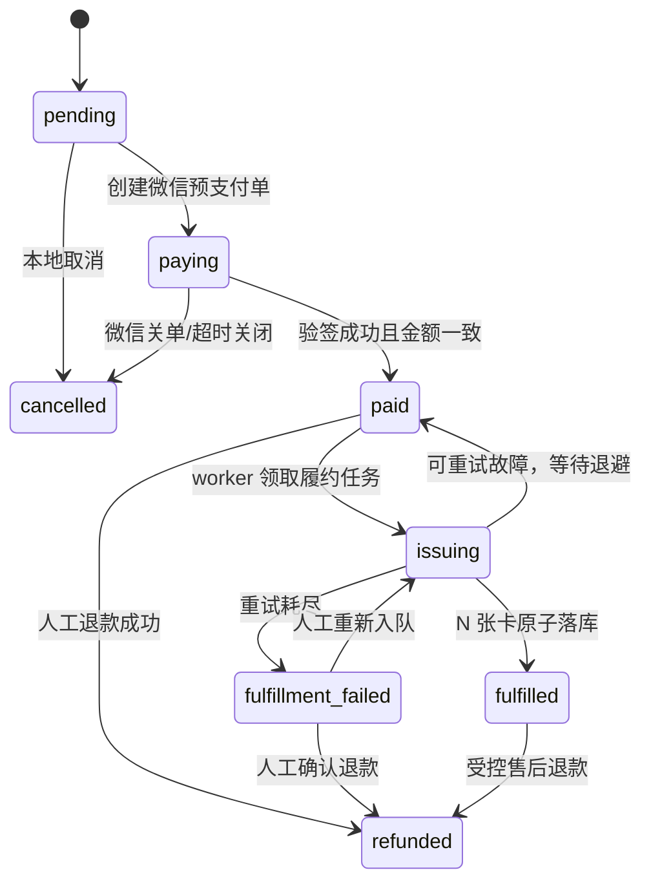

# CMS 真支付 webhook P0 设计方案

> 适用范围：`services/admin` 内 CMS 权益卡订单
>
> 结论：P0 工作量 **2–3 个工作日**；首发仅接 **微信支付 v3**；先补齐验签、数据库幂等、订单状态机、异步发卡和持久化重试，再开放真实商户流量。
>
> 决策状态：D1–D5 已全部定案，不再保留待拍板项。

---

## 1. 背景

当前 CMS 已走通“公开下单 → MockGateway 立即成功 → 优惠券核销 → 推荐返佣 → 自动生成 1 张资产卡”的开发链路，但真实支付回调仍是 14 行占位实现。

若直接把 MockGateway 换成真实网关，会暴露五个 P0 风险：

1. 回调无验签，攻击者可伪造支付成功；
2. 回调无数据库幂等，微信重试或并发通知可重复核券、返佣、发卡；
3. 订单只有粗粒度 `pay_status`，不能表达支付成功但发卡未完成；
4. 支付确认与发卡绑在同步请求内，进程退出或发卡异常会留下不一致数据；
5. 无持久化重试和人工补偿入口，用户可能“钱已付、卡未到”。

P0 的目标不是一次建成完整支付中台，而是在 2–3 天内建立最小但可靠的商业闭环：

- 只支持微信支付 v3，保留 provider adapter 扩展点；
- 真实回调必须先验签、再解密、再校验订单与金额；
- 支付事实一次确认，所有副作用均幂等；
- webhook 只负责把可靠事实落库并创建履约任务，不同步发卡；
- `BackgroundTasks` 负责低延迟触发，数据库 poller 负责崩溃恢复；
- 发卡失败不把已付款订单退回 `pending`，不自动退款；
- 重试耗尽后进入失败态、告警并由运营人工处理。

### 1.1 P0 非目标

- 不在首个 Sprint 同时接支付宝；
- 不引入 Celery、RabbitMQ、Kafka 等新基础设施；
- 不自动退款；
- 不重做 C 端收银台 UI；
- 不实现复杂对账平台，只保留查询与人工核验入口；
- 不删除旧 `pay_status`、`issued_card_no`、`issued_card_password` 字段，先留兼容窗口。

---

## 2. 代码调研结论

| # | 路径/对象 | 当前事实 | P0 影响 |
|---|-----------|----------|---------|
| 1 | `app/services/payment.py` | `PaymentGateway` 只有 `pay/refund/query`；默认全局实例为 `MockGateway` | 需新增微信 v3 adapter、回调验签/解密契约，mock 保留测试注入 |
| 2 | `app/routes/cms/payments.py` | `POST /notify/{gateway_name}` 无验签、无 DB、固定返回 `received=True` | P0 的主入口，必须整体重写 |
| 3 | `app/routes/cms/orders.py::pay_order` | 同步完成收款、改状态、核券、返佣和发卡 | 需抽出统一支付确认服务，真实模式不得由客户端直接“点一下即 paid” |
| 4 | `app/routes/cms/orders.py::_issue_card` | 每次只生成 1 张卡，未按 `quantity` 发卡 | D3 采用 `cms_order_card`，一单 N 卡 |
| 5 | `app/models/cms.py::ProductOrder` | 只有 `pay_status=pending|paid|cancelled`；卡号/密码是单值字段 | D2 迁移到 `status`；旧字段仅兼容，不再作为真相源 |
| 6 | `app/models/asset.py` | `AssetCard.card_no`、`unique_code` 唯一；批次有 `quantity/generated/status` | 发卡时必须锁批次并校验剩余库存 |
| 7 | `app/models/agent.py::ReferralCommission` | `product_order_id` 仅普通索引，无唯一约束 | 支付幂等需补唯一约束或冲突忽略，防重复返佣 |
| 8 | `app/db.py::init_db` | 仅 `Base.metadata.create_all`，不会修改既有表 | D2 必须有显式、可回滚、可重复执行的迁移步骤 |
| 9 | `app/main.py::lifespan` | 已有启动/关闭生命周期，可挂后台任务 | D4 的 DB poller 在 lifespan 启停 |
| 10 | `app/config.py` / `.env.example` | 尚无微信商户号、证书、API v3 key、回调 URL 配置 | 生产必须 fail-fast，密钥不得进库、日志和文档 |
| 11 | `tests/test_payment.py` / `tests/test_cms.py` | 只覆盖 mock 三方法和同步 `pending→paid→1 卡` | 需新增验签、并发幂等、状态机、多卡、重试和 E2E 用例 |

### 2.1 当前最危险的耦合

现有 `pay_order` 在一个请求中执行：

```text
MockGateway.pay
  → ProductOrder.pay_status = paid
  → Coupon.used_count += 1
  → ReferralCommission INSERT
  → _issue_card 生成 1 张卡
  → COMMIT
  → notify
```

真实支付不能复用这个时序。客户端请求只应创建微信支付单；最终支付事实必须以经过验签的微信回调或主动查单结果为准。

---

## 3. 五项缺口实施方案

## 3.1 缺口一：微信支付 v3 回调验签与解密

### 3.1.1 已定方案

首发 provider 固定为 `wechat`，URL 保持：

```http
POST /admin/api/v1/cms/payments/notify/wechat
```

其他 `gateway_name` 一律返回 404，不允许动态 import 或按用户输入选择任意处理器。

回调处理顺序不可调整：

1. 读取原始 `body: bytes`，不得先 `request.json()` 后重新序列化；
2. 读取 `Wechatpay-Timestamp`、`Wechatpay-Nonce`、`Wechatpay-Signature`、`Wechatpay-Serial`；
3. 校验时间窗，默认允许服务器时间与回调时间相差不超过 300 秒；
4. 按证书序列号选择微信支付平台证书；
5. 使用平台证书公钥验证 `timestamp\nnonce\nbody\n` 的 RSA-SHA256 签名；
6. 使用 API v3 key 对 `resource` 做 AES-256-GCM 解密；
7. 解析 `id`、`event_type`、`out_trade_no`、`transaction_id`、`trade_state`、`amount.total/currency`；
8. 只接受 `TRANSACTION.SUCCESS` 且 `trade_state=SUCCESS`；
9. 将金额从“分”与订单 `Decimal` 金额精确比对；
10. 进入数据库幂等事务。

### 3.1.2 Provider 契约

建议在保持旧 mock 可用的同时，把真实网关能力扩为显式 adapter：

```python
@dataclass(frozen=True)
class PaymentNotification:
    provider: str
    event_id: str
    event_type: str
    order_no: str
    transaction_id: str
    amount_fen: int
    currency: str
    trade_state: str
    payload_hash: str

class PaymentGateway(Protocol):
    async def create_payment(self, order_no: str, amount_fen: int, subject: str) -> PaymentResult: ...
    async def query(self, order_no: str, transaction_id: str = "") -> PaymentResult: ...
    async def close(self, order_no: str) -> PaymentResult: ...
    async def refund(self, order_no: str, transaction_id: str, amount_fen: int) -> PaymentResult: ...
    async def verify_callback(self, headers: Mapping[str, str], body: bytes) -> PaymentNotification: ...
```

P0 可用兼容包装保留旧 `pay(order_id, amount, subject)`，但真实微信路径必须走 `create_payment`；P1 再删除旧签名。

### 3.1.3 验签核心示意

以下代码只表达安全顺序，实施时按项目类型与异常体系落地：

```python
async def verify_callback(self, headers: Mapping[str, str], body: bytes) -> PaymentNotification:
    timestamp = require_header(headers, "Wechatpay-Timestamp")
    nonce = require_header(headers, "Wechatpay-Nonce")
    signature = require_header(headers, "Wechatpay-Signature")
    serial = require_header(headers, "Wechatpay-Serial")

    ensure_timestamp_within(timestamp, tolerance_seconds=300)
    certificate = self.certificate_store.require(serial)
    message = f"{timestamp}\n{nonce}\n".encode() + body + b"\n"
    verify_rsa_sha256(certificate.public_key(), message, signature)

    envelope = json.loads(body)
    plaintext = decrypt_aes_gcm(
        key=self.api_v3_key,
        nonce=envelope["resource"]["nonce"],
        ciphertext=envelope["resource"]["ciphertext"],
        associated_data=envelope["resource"].get("associated_data", ""),
    )
    return parse_wechat_notification(envelope, plaintext)
```

### 3.1.4 证书与密钥

新增配置建议：

| 环境变量 | 用途 | 生产要求 |
|----------|------|----------|
| `PAYMENT_PROVIDER` | `mock|wechat` | 生产真支付时固定 `wechat` |
| `WECHAT_PAY_MCH_ID` | 商户号 | 非空 |
| `WECHAT_PAY_APP_ID` | AppID | 非空 |
| `WECHAT_PAY_MCH_CERT_SERIAL_NO` | 商户证书序列号 | 非空 |
| `WECHAT_PAY_PRIVATE_KEY_PATH` | 商户私钥路径 | 文件权限 600，不存 DB |
| `WECHAT_PAY_API_V3_KEY` | 回调资源解密 key | secret，禁止日志输出 |
| `WECHAT_PAY_PLATFORM_CERT_DIR` | 微信平台证书目录 | 按 serial 加载、支持轮换 |
| `WECHAT_PAY_NOTIFY_URL` | HTTPS 回调地址 | 固定公开域名 |
| `PAYMENT_CALLBACK_TOLERANCE_SECONDS` | 防重放时间窗 | 默认 300 |

生产模式若 `PAYMENT_PROVIDER=wechat` 但任一关键配置缺失，应启动失败；开发环境继续默认 mock。

### 3.1.5 HTTP 应答策略

- 签名错误、证书未知、解密失败：拒绝请求，不写业务状态；
- 数据库暂时故障：返回非 2xx，让微信重试；
- 已验签但订单不存在、金额不符等永久业务异常：落入 `rejected` 事件并发出高优告警，再返回成功应答，避免无限重试风暴；
- 支付事实和履约任务已可靠提交：立即成功应答，发卡结果不影响 webhook ACK。

---

## 3.2 缺口二：数据库幂等表

### 3.2.1 表设计

新增 `cms_payment_idempotency`，事件记录既是幂等闸门，也是审计事实：

```python
class PaymentIdempotency(Base):
    __tablename__ = "cms_payment_idempotency"
    __table_args__ = (
        UniqueConstraint("provider", "event_id", name="uq_cms_pay_event"),
        UniqueConstraint("provider", "transaction_id", name="uq_cms_pay_transaction"),
    )

    id = pk()
    provider = Column(String(20), nullable=False)
    event_id = Column(String(80), nullable=False)
    event_type = Column(String(64), nullable=False)
    transaction_id = Column(String(100), nullable=False)
    order_id = Column(BigInteger, ForeignKey("cms_product_order.id"), nullable=True, index=True)
    amount_fen = Column(BigInteger, nullable=False)
    currency = Column(String(8), default="CNY", nullable=False)
    payload_hash = Column(String(64), nullable=False)
    status = Column(String(20), default="processing", nullable=False)
    attempt_count = Column(Integer, default=1, nullable=False)
    last_error = Column(String(500), nullable=True)
    received_at = Column(DateTime, default=utcnow, nullable=False)
    processed_at = Column(DateTime, nullable=True)
```

`status` 建议取值：`processing|succeeded|duplicate|rejected|failed`。

只保存必要摘要和 SHA-256，不持久化完整回调明文中的用户标识；不得保存签名、API v3 key、私钥或完整敏感头。

### 3.2.2 幂等边界

幂等必须覆盖整个支付确认副作用，而不只是“订单已经 paid 就 return”：

- 订单状态只迁移一次；
- `paid_at` 与 `transaction_id` 只首次写入；
- 优惠券 `used_count` 只加一次；
- 推荐返佣只创建一条；
- 履约任务只创建一条；
- 多卡每个 `item_no` 只发一次。

因此还需增加约束：

- `cms_product_order.order_no` 唯一；
- `cms_product_order(provider, transaction_id)` 唯一或等价唯一索引；
- `referral_commission.product_order_id` 唯一；
- `cms_payment_retry_queue(order_id, job_type)` 唯一；
- `cms_order_card(order_id, item_no)` 唯一；
- `cms_order_card.asset_card_id` 唯一。

### 3.2.3 并发算法

```python
async with session.begin():
    event = await insert_event_on_conflict_do_nothing(notification)
    if event is None:
        return CallbackResult.duplicate()

    order = await session.scalar(
        select(ProductOrder)
        .where(ProductOrder.order_no == notification.order_no)
        .with_for_update()
    )
    validate_order_and_amount(order, notification)
    transition(order, "paid")
    apply_coupon_once(order)
    create_referral_commission_once(order)
    enqueue_issue_job_once(order)
    event.status = "succeeded"
    event.processed_at = utcnow()
```

SQLite 单测不能完全模拟 PostgreSQL 的 `FOR UPDATE SKIP LOCKED`；并发正确性必须补 PostgreSQL 集成测试。

---

## 3.3 缺口三：订单状态机与 `status` 字段迁移

### 3.3.1 状态定义

D2 采用迁移 `status`，不继续扩大 `pay_status`：

| 状态 | 含义 | 是否已收款 | 是否完成发卡 |
|------|------|------------|--------------|
| `pending` | 本地订单已创建，尚未拉起支付 | 否 | 否 |
| `paying` | 已创建微信预支付单，等待结果 | 未确认 | 否 |
| `paid` | 微信已确认成功，履约任务已持久化 | 是 | 否 |
| `issuing` | worker 正在发卡 | 是 | 否 |
| `fulfilled` | 已按 quantity 全量发卡 | 是 | 是 |
| `fulfillment_failed` | 重试耗尽，等待人工处理 | 是 | 否/不完整 |
| `cancelled` | 未支付订单关闭 | 否 | 否 |
| `refunded` | 已人工或受控退款 | 曾收款 | 视业务处理 |

### 3.3.2 状态机



禁止的关键转移：

- `paid|issuing|fulfilled|fulfillment_failed → pending`；
- `cancelled → paid` 自动覆盖；遇到“本地已取消、微信却成功”必须隔离告警并主动查单；
- `fulfilled → issuing` 自动重跑；人工补发必须明确指定缺失 `item_no`。

### 3.3.3 迁移策略

`create_all()` 不会给旧表加字段，必须执行显式迁移：

1. 增加 nullable `order_no`、`status`、`provider`；
2. 为历史订单生成稳定 `order_no`；
3. 按旧数据回填：
   - `pay_status=pending` → `pending`；
   - `pay_status=cancelled` → `cancelled`；
   - `pay_status=paid` 且有卡号 → `fulfilled`；
   - `pay_status=paid` 且无卡号 → `paid`；
4. 设置 `order_no/status` 非空并建立唯一索引；
5. 新代码双写 `status` 与兼容字段 `pay_status`；
6. API 响应继续输出 `pay_status`，值由 `status` 映射；
7. 列表筛选同时接受 `status` 和旧 `pay_status`；
8. 至少一个发布周期后再移除旧字段。

历史 `quantity>1` 但只有单卡字段的订单不可自动补发。迁移只回填可确认的第 1 张卡，其余差额输出对账报告，由运营确认后再入队。

---

## 3.4 缺口四：webhook 确认支付后异步发卡

### 3.4.1 支付与履约分层

支付回调事务只做：

```text
验签/解密
  → 幂等事件 INSERT
  → 锁订单并核对金额
  → 订单转 paid
  → 优惠券/返佣幂等落库
  → INSERT 发卡任务
  → COMMIT
  → BackgroundTasks 低延迟唤醒 worker
  → HTTP 200
```

发卡 worker 使用新 session、新事务处理，不复用 webhook 的 request session。

### 3.4.2 多件订单模型

D3 采用 `cms_order_card`，不再把卡信息压在订单单值字段：

```python
class OrderCard(Base):
    __tablename__ = "cms_order_card"
    __table_args__ = (
        UniqueConstraint("order_id", "item_no", name="uq_cms_order_card_item"),
        UniqueConstraint("asset_card_id", name="uq_cms_order_card_asset"),
    )

    id = pk()
    order_id = Column(BigInteger, ForeignKey("cms_product_order.id"), nullable=False, index=True)
    item_no = Column(Integer, nullable=False)  # 1..order.quantity
    asset_card_id = Column(BigInteger, ForeignKey("asset_card.id"), nullable=False)
    card_no = Column(String(32), nullable=False)
    credential_ciphertext = Column(Text, nullable=False)
    status = Column(String(20), default="issued", nullable=False)
    issued_at = Column(DateTime, default=utcnow, nullable=False)
    created_at = Column(DateTime, default=utcnow, nullable=False)
```

卡密码不得继续以明文批量存储。建议用独立 `CARD_CREDENTIAL_KEY` 加密后存 `credential_ciphertext`，日志只记录订单号、`item_no` 和脱敏卡号。旧 `issued_card_no/password` 仅保留 API 兼容，P0 后停止作为真相源。

### 3.4.3 持久化任务表

```python
class PaymentRetryJob(Base):
    __tablename__ = "cms_payment_retry_queue"
    __table_args__ = (
        UniqueConstraint("order_id", "job_type", name="uq_cms_payment_retry_job"),
    )

    id = pk()
    order_id = Column(BigInteger, ForeignKey("cms_product_order.id"), nullable=False, index=True)
    job_type = Column(String(32), default="issue_cards", nullable=False)
    status = Column(String(20), default="pending", nullable=False, index=True)
    attempts = Column(Integer, default=0, nullable=False)
    max_attempts = Column(Integer, default=5, nullable=False)
    next_retry_at = Column(DateTime, default=utcnow, nullable=False, index=True)
    locked_at = Column(DateTime, nullable=True)
    locked_by = Column(String(80), nullable=True)
    last_error = Column(String(500), nullable=True)
    completed_at = Column(DateTime, nullable=True)
    created_at = Column(DateTime, default=utcnow, nullable=False)
    updated_at = Column(DateTime, default=utcnow, onupdate=utcnow, nullable=False)
```

任务状态：`pending|running|retry|succeeded|failed`。

### 3.4.4 BackgroundTasks + DB poller

D4 的组合方式：

- webhook commit 后调用 `background_tasks.add_task(process_job_by_id, job_id)`；
- BackgroundTasks 只做“尽快处理”，不承担持久性保证；
- lifespan 启动 poller，每 5 秒扫描到期的 `pending|retry` 任务；
- PostgreSQL 用 `FOR UPDATE SKIP LOCKED` 领取任务；
- `running` 超过租约时间的任务视为 worker 崩溃，重置为 `retry`；
- 应用关闭时取消 poller 并等待当前事务结束；
- 多实例部署时依靠行锁与唯一约束，不依靠进程内锁。

```python
async def claim_jobs(session: AsyncSession, limit: int = 20) -> list[PaymentRetryJob]:
    rows = await session.scalars(
        select(PaymentRetryJob)
        .where(
            PaymentRetryJob.status.in_(["pending", "retry"]),
            PaymentRetryJob.next_retry_at <= utcnow(),
        )
        .order_by(PaymentRetryJob.next_retry_at)
        .with_for_update(skip_locked=True)
        .limit(limit)
    )
    jobs = list(rows)
    for job in jobs:
        job.status = "running"
        job.locked_at = utcnow()
        job.locked_by = WORKER_ID
    return jobs
```

### 3.4.5 发卡原子性

一次订单发卡事务应执行：

1. 锁订单；
2. 验证订单在 `paid|issuing`；
3. 读取已存在的 `cms_order_card.item_no`；
4. 计算缺失序号；
5. 锁产品关联的可用批次；
6. 校验 `quantity - generated >= 缢失数量`；
7. 为每个缺失 `item_no` 生成 AssetCard；
8. 创建对应 OrderCard；
9. 批次 `generated += 新增数量`；
10. 数量达到订单 quantity 后转 `fulfilled`；
11. 任务转 `succeeded` 并提交。

唯一约束使崩溃后的重跑只补缺失项，不重复发已成功的 `item_no`。

---

## 3.5 缺口五：失败回滚、重试与人工补偿

### 3.5.1 事务边界

“失败回滚”分两层：

- 支付确认事务失败：整笔回滚，返回非 2xx，等待微信重试；
- 发卡事务失败：仅回滚本次卡、订单卡关联和批次计数，已确认的支付事实保持 `paid`。

绝不把微信已确认成功的订单改回 `pending`。支付事实不是可随发卡异常撤销的本地状态。

### 3.5.2 重试策略

建议最大 5 次，指数退避并带少量抖动：

| 失败次数 | 下次重试建议 |
|----------|--------------|
| 1 | 30 秒后 |
| 2 | 2 分钟后 |
| 3 | 10 分钟后 |
| 4 | 30 分钟后 |
| 5 | 停止自动重试，转人工 |

可重试：数据库瞬断、锁冲突、短时依赖故障。

不可盲目重试：库存不足、产品无 `card_type_id`、无可用批次、配置缺失、数据约束冲突。此类错误可直接进入 `retry` 的长退避或 `failed`，同时告警。

### 3.5.3 耗尽补偿

D5 采用“failed + 告警 + 人工”：

```python
if job.attempts >= job.max_attempts:
    job.status = "failed"
    order.status = "fulfillment_failed"
    await notify("CMS 支付后发卡失败", safe_incident_payload(order, job))
else:
    job.status = "retry"
    job.next_retry_at = utcnow() + retry_delay(job.attempts)
```

运营处理动作限定为：

- 查微信订单确认真实支付；
- 修复产品卡类型或补充批次库存；
- 点击“重新入队”，只补缺失 `item_no`；
- 或在确认业务条件后走人工退款；
- 所有人工动作写审计日志。

P0 禁止自动退款，因为卡可能已部分交付或被展示，自动退款可能造成“卡和钱同时损失”。

### 3.5.4 告警内容

告警只包含：内部订单号、微信交易号脱敏值、金额、任务次数、错误类别、缺失卡数量、后台订单链接。不得包含卡密码、API key、私钥、完整手机号或完整回调体。

---

## 4. 数据模型 ER 图

```mermaid
erDiagram
    CMS_TOUR_PRODUCT ||--o{ CMS_PRODUCT_ORDER : "product_id"
    CMS_PRODUCT_ORDER ||--o{ CMS_PAYMENT_IDEMPOTENCY : "order_id"
    CMS_PRODUCT_ORDER ||--|| CMS_PAYMENT_RETRY_QUEUE : "order_id + issue_cards"
    CMS_PRODUCT_ORDER ||--o{ CMS_ORDER_CARD : "order_id"
    CMS_PRODUCT_ORDER }o--|| CMS_COUPON : "coupon_id"
    CMS_PRODUCT_ORDER }o--|| AGENT : "referrer_agent_id"
    CMS_PRODUCT_ORDER ||--o| REFERRAL_COMMISSION : "product_order_id"
    CMS_ORDER_CARD }o--|| ASSET_CARD : "asset_card_id"
    ASSET_CARD }o--|| ASSET_CARD_BATCH : "batch_id"
    ASSET_CARD_BATCH }o--|| ASSET_CARD_TYPE : "type_id"
    CMS_TOUR_PRODUCT }o--|| ASSET_CARD_TYPE : "card_type_id"

    CMS_PRODUCT_ORDER {
        bigint id PK
        string order_no UK
        bigint product_id FK
        int quantity
        numeric total
        string provider
        string transaction_id UK
        string status
        datetime paid_at
        string pay_status "legacy"
    }
    CMS_PAYMENT_IDEMPOTENCY {
        bigint id PK
        string provider
        string event_id UK
        string transaction_id UK
        bigint order_id FK
        bigint amount_fen
        string payload_hash
        string status
        datetime processed_at
    }
    CMS_PAYMENT_RETRY_QUEUE {
        bigint id PK
        bigint order_id FK_UK
        string job_type
        string status
        int attempts
        int max_attempts
        datetime next_retry_at
        string last_error
    }
    CMS_ORDER_CARD {
        bigint id PK
        bigint order_id FK
        int item_no UK
        bigint asset_card_id FK_UK
        string card_no
        text credential_ciphertext
        string status
        datetime issued_at
    }
```

---

## 5. 推荐方案 vs 备选方案

| 议题 | 推荐方案 | 备选方案 | 结论 |
|------|----------|----------|------|
| Provider | 首发仅微信支付 v3，adapter 留扩展点 | 微信+支付宝同时接 | 采用推荐；双接会把 2–3 天变成至少 4–6 天 |
| 回调安全 | 平台证书 RSA-SHA256 验签 + API v3 AES-GCM 解密 | 仅校验商户号/IP/自定义 token | 采用推荐；备选不满足微信 v3 安全边界 |
| 幂等介质 | PostgreSQL 唯一约束 + 行锁 | Redis `SETNX` | 采用推荐；Redis 失效或淘汰不能作为支付事实源 |
| 订单状态 | 新 `status` 并迁移、兼容旧 `pay_status` | 继续扩展 `pay_status` | 采用推荐；支付与履约需要分层表达 |
| 异步执行 | BackgroundTasks 低延迟 + DB poller 持久恢复 | 纯 BackgroundTasks 或立即引入 Celery | 采用推荐；前者会丢任务，后者超出 P0 工期 |
| 重试耗尽 | `fulfillment_failed` + 告警 + 人工补偿 | 自动退款或无限重试 | 采用推荐；自动退款风险过大，无限重试会制造故障风暴 |

多件订单另采用独立 `cms_order_card`，不采用 JSON 卡号数组，也不接受只发第 1 张卡。

---

## 6. 实施顺序（11 步）

1. 冻结当前 mock 支付基线并补迁移前测试；
2. 增加支付配置、生产 fail-fast 和 secret 脱敏；
3. 扩展 `PaymentGateway`，实现 `WechatPayV3Gateway.verify_callback`；
4. 增加 `ProductOrder.order_no/status/provider` 与兼容映射；
5. 新增 `cms_payment_idempotency`；
6. 新增 `cms_order_card`，完成历史单卡数据可确认部分的回填；
7. 新增 `cms_payment_retry_queue` 与必要唯一约束；
8. 抽取统一 `confirm_payment` 和 `issue_order_cards` service；
9. 重写 webhook，并在 commit 后通过 BackgroundTasks 唤醒任务；
10. 在 lifespan 接入 DB poller、租约恢复、退避和告警；
11. 跑单元/集成/E2E，灰度开启微信回调，再切 `PAYMENT_PROVIDER=wechat`。

每一步都必须可独立回滚；在第 11 步前生产仍保持 mock 或禁用真实收款入口。

---

## 7. 2–3 工作日 Sprint Plan

| Day | 目标 | 主要产出 | 验收门槛 |
|-----|------|----------|----------|
| Day 1 | 安全入口 + 数据底座 | 微信验签/解密 adapter；配置 fail-fast；三张新表；订单状态迁移 | 伪造、过期、未知证书回调全部拒绝；迁移可重复执行 |
| Day 2 | 支付确认 + 多卡履约 | webhook 幂等事务；状态机；N 卡发放；BackgroundTasks；DB poller | 同一回调并发 10 次只核券/返佣/建任务一次；quantity=N 发 N 张 |
| Day 3 | 补偿 + 灰度 | 重试/租约/告警；PostgreSQL 并发测试；微信沙箱/小额真单 E2E；回滚手册 | 进程在 commit 后退出仍可由 poller 补发；耗尽后进入人工队列 |

若只有 2 天：Day 3 的管理 UI 可降级为 SQL/受保护脚本人工重新入队，但验签、幂等、状态机、多卡、持久化重试与告警不可删减。

---

## 8. 风险评估（14 项）

| # | 风险 | 等级 | 控制措施 |
|---|------|------|----------|
| 1 | 伪造回调导致零元发卡 | 严重 | 原始 body 验签、证书 serial 校验、AES-GCM 解密 |
| 2 | 回调重放 | 严重 | 300 秒时间窗 + event/transaction 双唯一约束 |
| 3 | 微信证书轮换后验签失败 | 高 | serial 路由证书、证书过期监控、双证书并存窗口 |
| 4 | 金额单位或 Decimal 转换错误 | 严重 | 全程整数分；统一 `yuan_to_fen`；拒绝浮点 |
| 5 | 订单号可猜或解析错误 | 高 | 新增不可猜唯一 `order_no`，不直接暴露自增 id |
| 6 | 并发通知重复核销优惠券 | 高 | 支付事件唯一约束 + 锁订单 + 副作用同事务 |
| 7 | 并发通知重复创建返佣 | 高 | `product_order_id` 唯一约束 + 冲突幂等 |
| 8 | quantity>1 只发一张 | 严重 | `cms_order_card.item_no` 唯一，一单 N 卡对账 |
| 9 | 批次超卖 | 严重 | 锁批次、校验剩余库存、批量原子提交 |
| 10 | webhook 已 ACK 但进程退出 | 高 | ACK 前持久化任务；poller 恢复，不依赖内存队列 |
| 11 | worker 执行中崩溃永久卡 `running` | 高 | `locked_at` 租约超时回收 |
| 12 | 自动退款与已发卡竞态 | 严重 | P0 禁止自动退款，人工核验缺失项和卡状态 |
| 13 | 卡密码/支付密钥泄露 | 严重 | secret 文件权限、日志脱敏、凭据密文存储、禁止落原始回调 |
| 14 | `create_all` 未迁移生产旧表 | 严重 | 显式 SQL/迁移脚本、预演、备份、回填校验与回滚步骤 |

---

## 9. 测试用例清单（32 项）

### 9.1 验签与解析

1. 缺少任一 `Wechatpay-*` 必需头时拒绝；
2. 时间戳超出 300 秒时拒绝；
3. RSA 签名错误时拒绝；
4. 未知平台证书 serial 时拒绝并告警；
5. AES-GCM nonce/ciphertext 错误时拒绝；
6. 合法回调可解出 `out_trade_no/transaction_id/amount/trade_state`；
7. 非 `wechat` provider 路径返回 404；
8. 非 SUCCESS 事件不进入支付成功状态。

### 9.2 幂等与金额

9. 同一 event_id 重放只处理一次；
10. 不同 event_id、同一 transaction_id 只处理一次；
11. 10 个并发相同回调只生成一条成功事件；
12. 未知订单进入 `rejected` 并告警；
13. 回调金额与订单不一致时不改订单；
14. 非 CNY 币种不改订单；
15. 优惠券 `used_count` 在重放后仍只加 1；
16. 推荐返佣在重放后仍只有 1 条。

### 9.3 状态机与兼容

17. `pending→paying→paid` 合法；
18. `paying→cancelled` 合法；
19. `paid→pending` 被拒绝；
20. `cancelled` 收到 SUCCESS 时进入隔离告警而非静默覆盖；
21. `paid` 重复确认不覆盖首次 `paid_at/transaction_id`；
22. API 旧 `pay_status` 能从新 `status` 正确映射；
23. 迁移脚本将四类历史订单正确回填；
24. 迁移脚本重复执行不重复建记录、不破坏数据。

### 9.4 多卡、任务与恢复

25. quantity=1 创建 1 条 OrderCard 和 1 张 AssetCard；
26. quantity=3 创建连续 item_no=1..3；
27. 重跑同一任务不会重复 item_no 或 AssetCard；
28. 库存不足时整批发卡回滚，批次 generated 不变；
29. 产品无 card_type 或无可用批次时任务进入可观测失败；
30. webhook commit 后模拟进程退出，poller 重启后完成发卡；
31. 任务连续失败达到 5 次后变 `failed`，订单变 `fulfillment_failed`，只告警一次；
32. 微信签名 fixture 的完整 E2E：下单→回调→ACK→异步 N 卡→订单 fulfilled。

### 9.5 测试运行建议

```bash
cd services/admin
PYTHONPATH=. pytest tests/test_payment.py tests/test_cms.py -v
PYTHONPATH=. pytest tests/integration/ -v
```

SQLite 用于大部分单元测试；涉及唯一约束竞争、`FOR UPDATE SKIP LOCKED`、租约抢占的用例必须在 PostgreSQL 临时库执行。微信回调使用固定测试证书与 fixture，不在 CI 放真实商户私钥。

---

## 10. 决策记录（全部已定案）

| 决策 | 已采用 | 具体落点 | 理由 |
|------|--------|----------|------|
| D1 | A：微信支付 v3 | 单 provider；adapter 预留扩展 | 2–3 天内可完整落地，避免双 provider 放大风险 |
| D2 | A：迁移 `status` | 新状态机；`pay_status` 留兼容窗口 | 长期模型清晰，支付与履约解耦 |
| D3 | A：新增 `cms_order_card` | 一单 N 卡；`item_no` 幂等 | 业务完整，不能只发第 1 张 |
| D4 | A：BackgroundTasks + DB poller | 低延迟触发 + 数据库持久恢复 | 不加新基础设施，又能防进程丢任务 |
| D5 | A：failed + 告警 + 人工 | 重试耗尽转 `fulfillment_failed` | 自动退款风险大，人工核验更安全 |

以上决策均为实施输入，不再列为待确认项。

---

## 11. 实施步骤（Day 1/2/3 详细任务）

## 11.1 Day 1：安全入口与数据迁移

### 上午

- 建立支付配置对象和生产 fail-fast；
- 建立 `WechatPayV3Gateway` 骨架与依赖注入；
- 实现原始 body 读取、必需 header 校验、时间窗校验；
- 实现平台证书按 serial 加载与 RSA-SHA256 验签；
- 实现 AES-GCM 解密和通知 DTO；
- 加入安全日志过滤器，禁止输出 body、签名、key 和私钥路径内容。

### 下午

- 给 ProductOrder 增加 `order_no/status/provider`；
- 新增 PaymentIdempotency、OrderCard、PaymentRetryJob；
- 补 transaction、referral、job、order-card 的唯一约束；
- 写幂等迁移脚本与 down/回滚说明；
- 用生产数据副本演练回填，输出总数、pending、paid、fulfilled、异常多件订单数；
- 完成验签/解密和迁移测试。

### Day 1 完成定义

- 任意未签名请求都不能触碰订单；
- 合法 fixture 能得到规范化 PaymentNotification；
- 新旧订单 API 均可读取；
- 迁移脚本第二次运行无副作用。

## 11.2 Day 2：幂等支付确认与异步多卡发放

### 上午

- 抽取 `confirm_payment(notification)`；
- 在同一事务内完成 event 插入、订单锁、金额校验、状态迁移、核券、返佣和任务入队；
- 重写 payments webhook；
- 明确永久异常隔离与暂时异常重试的 HTTP 策略；
- 旧 `/orders/{id}/pay` 在 mock 模式继续走统一确认服务，wechat 模式只创建预支付单。

### 下午

- 抽取 `issue_order_cards(order_id)`；
- 加批次行锁、库存校验和缺失 item_no 计算；
- 一次事务生成 N 张 AssetCard + N 条 OrderCard；
- 接 BackgroundTasks；
- 实现 poller claim、`SKIP LOCKED`、租约和优雅停止；
- 完成并发幂等、多卡、库存不足与崩溃恢复测试。

### Day 2 完成定义

- 微信重放与并发回调不产生重复副作用；
- webhook 在任务可靠落库后快速 ACK；
- quantity=N 最终恰好 N 张卡；
- worker 重启可恢复任务。

## 11.3 Day 3：补偿、灰度与上线

### 上午

- 实现 5 次指数退避；
- 实现 running 租约回收；
- 实现 `failed/fulfillment_failed` 和去重告警；
- 提供受保护的人工重新入队动作或运维命令；
- 增加微信主动查单工具，供异常订单人工核验；
- 完成 32 项测试与 PostgreSQL 并发测试。

### 下午

- 配置测试商户/低额商品和 HTTPS notify URL；
- 做 1 笔成功支付、1 次重复通知、1 次 worker 重启、1 次库存不足演练；
- 核对微信交易号、订单金额、优惠券、返佣、卡数量和告警；
- 先灰度单商品，再逐步放量；
- 保留 mock 回退开关，但禁止把已产生真实交易的订单切回 mock 处理；
- 记录上线、回滚和人工补偿 SOP。

### Day 3 完成定义

- 小额真单从微信支付到 `fulfilled` 全链路闭环；
- 同一通知重复投递结果不变；
- 任何失败都能在 DB、日志和告警中定位；
- 无“钱已付但系统无记录”或“重复发卡”现象。

---

## 12. 上线与回滚闸门

### 上线前必须满足

- 32 项测试全部通过；
- PostgreSQL 并发幂等测试通过；
- 平台证书有效期与 serial 已核实；
- 服务器时钟同步正常；
- notify URL 为公网 HTTPS；
- 商户私钥权限为最小可读；
- DB 已备份且迁移演练通过；
- 告警 webhook 可达；
- 人工补发和退款责任人明确。

### 回滚原则

- 代码可切回“禁止新建真实支付”，不能删除已落库支付事件；
- 不回滚已确认订单到 pending；
- 新表保留以便审计；
- 迁移 down 只在确认无真实交易时执行；
- 已有真实交易通过查单、补发或人工退款收口。

---

## 13. Critical Files for Implementation

以下 5 个文件是实施主路径：

1. `services/admin/app/services/payment.py` — PaymentGateway 扩展、WechatPayV3Gateway、验签/解密与通知 DTO；
2. `services/admin/app/routes/cms/payments.py` — webhook 入口、ACK 策略、BackgroundTasks 触发；
3. `services/admin/app/routes/cms/orders.py` — 拆出同步 mock 逻辑，统一支付确认与多卡发放调用；
4. `services/admin/app/models/cms.py` — ProductOrder 状态迁移及三张 P0 表；
5. `services/admin/tests/test_payment.py` — 验签、幂等、状态机、重试主测试集。

配套但非上述五个主文件：

- `services/admin/app/schemas/cms.py` — 新状态与 cards 输出兼容；
- `services/admin/app/config.py` / `.env.example` — 微信支付配置与 fail-fast；
- `services/admin/app/main.py` — DB poller 生命周期；
- `services/admin/app/models/agent.py` — 推荐返佣唯一约束；
- 数据库迁移脚本 — 旧字段回填、唯一约束、新表与回滚。

---

## 14. 最终验收口径

P0 只有同时满足以下条件才算完成：

1. 未通过微信 v3 验签的请求无法改变任何业务状态；
2. 任意次数重放或并发回调只确认一次支付；
3. 订单状态能区分“已付款”和“已发卡”；
4. quantity=N 最终恰好关联 N 张卡；
5. webhook ACK 后即使进程退出，任务仍可恢复；
6. 发卡失败不篡改支付事实；
7. 重试耗尽可告警、可审计、可人工重新入队；
8. 历史 API 在兼容窗口内不被破坏；
9. 真实支付密钥、卡密码和原始敏感回调不进入日志或 Git；
10. 小额真单 E2E 与回滚演练均通过。
